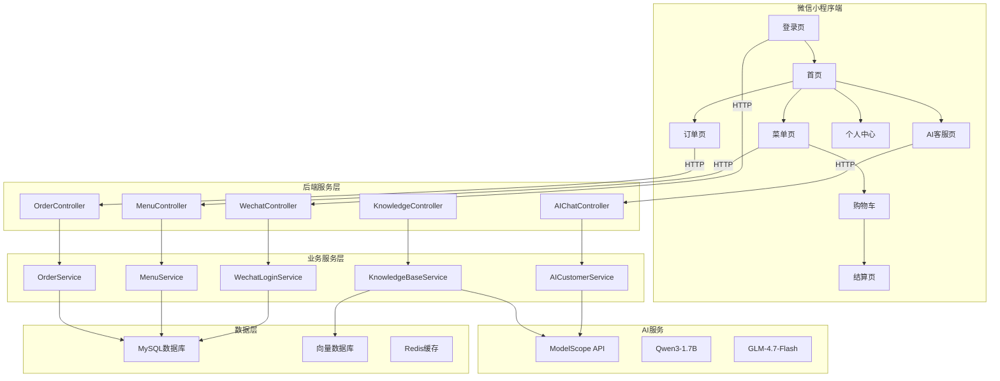
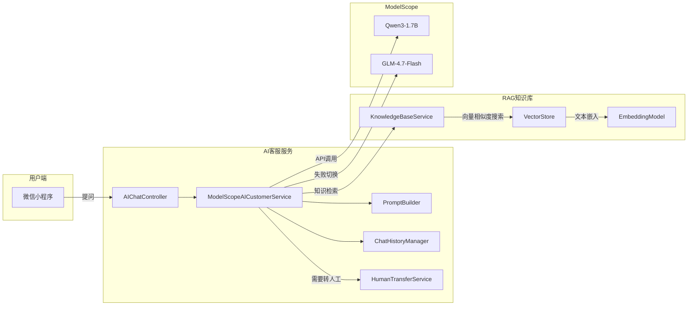
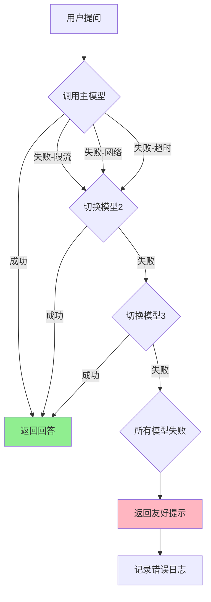
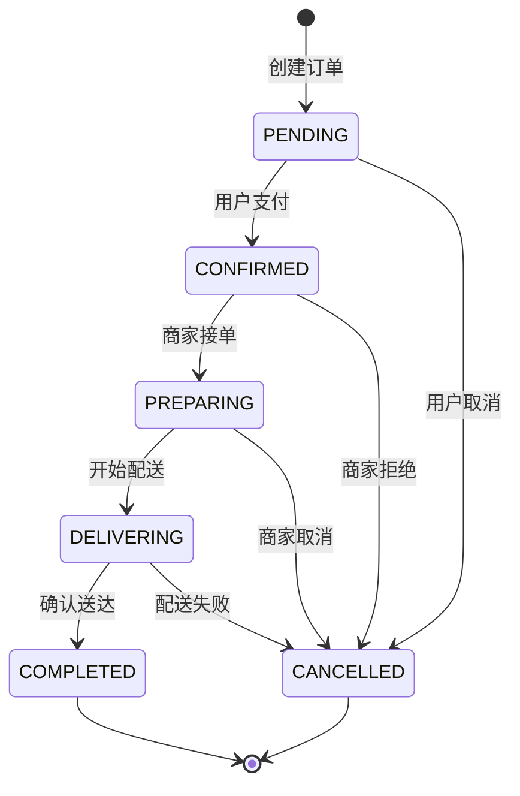
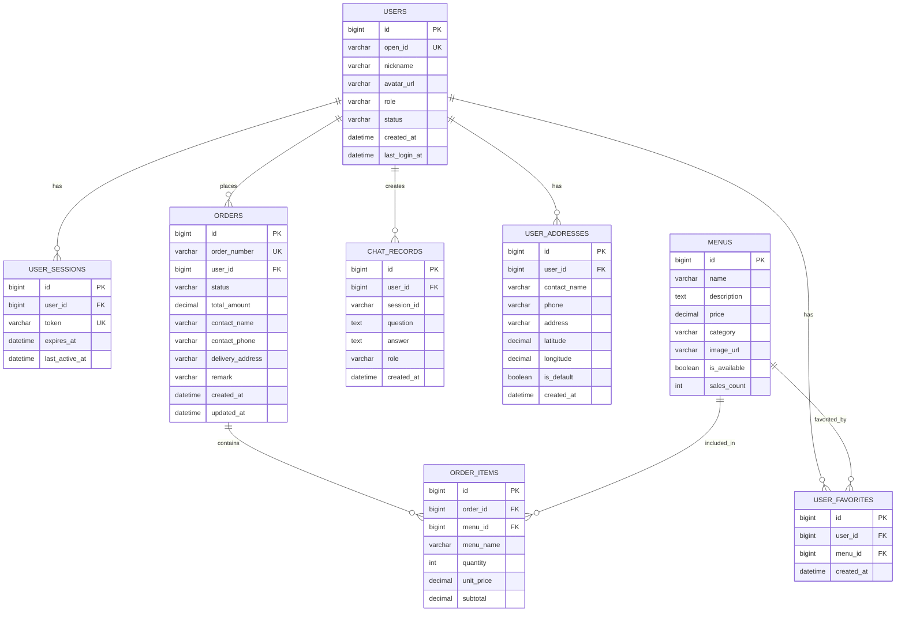
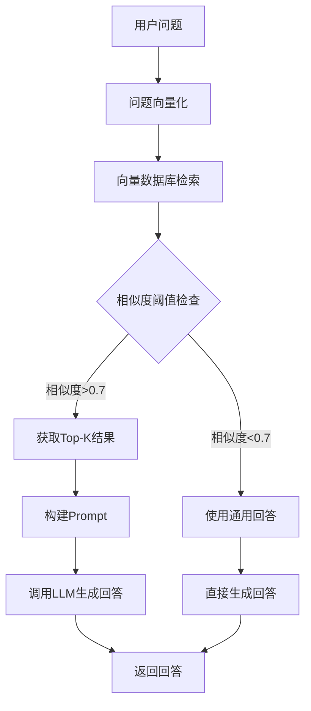
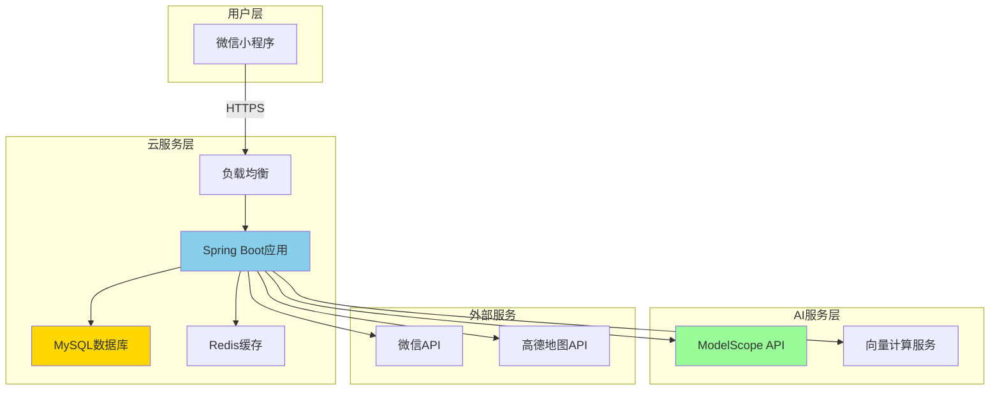

# 论文架构图

## 系统总体架构图

```mermaid
graph TB
    subgraph 微信小程序端
        A1[登录页] --> A2[首页]
        A2 --> A3[菜单页]
        A2 --> A4[订单页]
        A2 --> A5[AI客服页]
        A2 --> A6[个人中心]
        A3 --> A7[购物车]
        A7 --> A8[结算页]
    end

    subgraph 后端服务层
        B1[WechatController]
        B2[MenuController]
        B3[OrderController]
        B4[AIChatController]
        B5[KnowledgeController]
    end

    subgraph 业务服务层
        C1[WechatLoginService]
        C2[MenuService]
        C3[OrderService]
        C4[AICustomerService]
        C5[KnowledgeBaseService]
    end

    subgraph 数据层
        D1[MySQL数据库]
        D2[向量数据库]
        D3[Redis缓存]
    end

    subgraph AI服务
        E1[ModelScope API]
        E2[Qwen3-1.7B]
        E3[GLM-4.7-Flash]
    end

    A1 -->|HTTP| B1
    A3 -->|HTTP| B2
    A4 -->|HTTP| B3
    A5 -->|HTTP| B4

    B1 --> C1
    B2 --> C2
    B3 --> C3
    B4 --> C4
    B5 --> C5

    C1 --> D1
    C2 --> D1
    C3 --> D1
    C4 --> E1
    C5 --> D2
    C5 --> E1
```

## AI客服模块架构图

```mermaid
graph LR
    subgraph 用户端
        A[微信小程序]
    end

    subgraph AI客服服务
        B[AIChatController]
        C[ModelScopeAICustomerService]
        D[PromptBuilder]
        E[ChatHistoryManager]
        F[HumanTransferService]
    end

    subgraph RAG知识库
        G[KnowledgeBaseService]
        H[VectorStore]
        I[EmbeddingModel]
    end

    subgraph ModelScope
        J[Qwen3-1.7B]
        K[GLM-4.7-Flash]
    end

    A -->|提问| B
    B --> C
    C --> D
    C --> E
    C -->|知识检索| G
    G -->|向量相似度搜索| H
    H -->|文本嵌入| I
    C -->|API调用| J
    C -->|失败切换| K
    C -->|需要转人工| F
```

## 多模型容错流程图

```mermaid
flowchart TD
    A[用户提问] --> B{调用主模型}
    B -->|成功| C[返回回答]
    B -->|失败-限流| D{切换模型2}
    B -->|失败-网络| D
    B -->|失败-超时| D

    D -->|成功| C
    D -->|失败| E{切换模型3}

    E -->|成功| C
    E -->|失败| F{所有模型失败}

    F --> G[返回友好提示]
    G --> H[记录错误日志]

    style C fill:#90EE90
    style G fill:#FFB6C1
```

## 订单状态流转图

```mermaid
stateDiagram-v2
    [*] --> PENDING: 创建订单
    PENDING --> CONFIRMED: 用户支付
    PENDING --> CANCELLED: 用户取消
    CONFIRMED --> PREPARING: 商家接单
    CONFIRMED --> CANCELLED: 商家拒绝
    PREPARING --> DELIVERING: 开始配送
    PREPARING --> CANCELLED: 商家取消
    DELIVERING --> COMPLETED: 确认送达
    DELIVERING --> CANCELLED: 配送失败
    COMPLETED --> [*]
    CANCELLED --> [*]
```

## 数据库ER图

```mermaid
erDiagram
    USERS ||--o{ USER_SESSIONS : has
    USERS ||--o{ ORDERS : places
    USERS ||--o{ CHAT_RECORDS : creates
    USERS ||--o{ USER_FAVORITES : has
    USERS ||--o{ USER_ADDRESSES : has
    ORDERS ||--o{ ORDER_ITEMS : contains
    MENUS ||--o{ ORDER_ITEMS : included_in
    MENUS ||--o{ USER_FAVORITES : favorited_by

    USERS {
        bigint id PK
        varchar open_id UK
        varchar nickname
        varchar avatar_url
        varchar role
        varchar status
        datetime created_at
        datetime last_login_at
    }

    USER_SESSIONS {
        bigint id PK
        bigint user_id FK
        varchar token UK
        datetime expires_at
        datetime last_active_at
    }

    ORDERS {
        bigint id PK
        varchar order_number UK
        bigint user_id FK
        varchar status
        decimal total_amount
        varchar contact_name
        varchar contact_phone
        varchar delivery_address
        varchar remark
        datetime created_at
        datetime updated_at
    }

    ORDER_ITEMS {
        bigint id PK
        bigint order_id FK
        bigint menu_id FK
        varchar menu_name
        int quantity
        decimal unit_price
        decimal subtotal
    }

    MENUS {
        bigint id PK
        varchar name
        text description
        decimal price
        varchar category
        varchar image_url
        boolean is_available
        int sales_count
    }

    CHAT_RECORDS {
        bigint id PK
        bigint user_id FK
        varchar session_id
        text question
        text answer
        varchar role
        datetime created_at
    }

    USER_FAVORITES {
        bigint id PK
        bigint user_id FK
        bigint menu_id FK
        datetime created_at
    }

    USER_ADDRESSES {
        bigint id PK
        bigint user_id FK
        varchar contact_name
        varchar phone
        varchar address
        decimal latitude
        decimal longitude
        boolean is_default
        datetime created_at
    }
```

## RAG知识检索流程图

```mermaid
flowchart TD
    A[用户问题] --> B[问题向量化]
    B --> C[向量数据库检索]
    C --> D{相似度阈值检查}
    D -->|相似度>0.7| E[获取Top-K结果]
    D -->|相似度<0.7| F[使用通用回答]
    E --> G[构建Prompt]
    F --> H[直接生成回答]
    G --> I[调用LLM生成回答]
    I --> J[返回回答]
    H --> J
```

## 系统部署架构图

```mermaid
graph TB
    subgraph 用户层
        A[微信小程序]
    end

    subgraph 云服务层
        B[负载均衡]
        C[Spring Boot应用]
        D[MySQL数据库]
        E[Redis缓存]
    end

    subgraph AI服务层
        F[ModelScope API]
        G[向量计算服务]
    end

    subgraph 外部服务
        H[微信API]
        I[高德地图API]
    end

    A -->|HTTPS| B
    B --> C
    C --> D
    C --> E
    C --> F
    C --> G
    C --> H
    C --> I

    style C fill:#87CEEB
    style D fill:#FFD700
    style F fill:#98FB98
```
